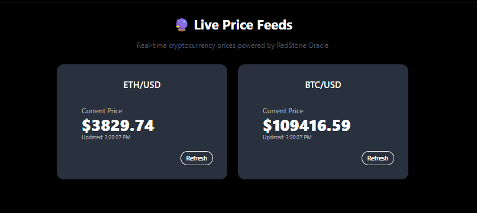
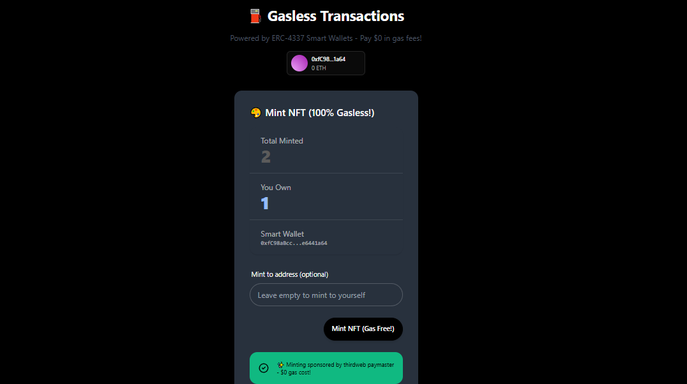

# 🚀 Speed Run Lisk — Oracles & Sponsored Transactions

This project is part of the **Lisk SEA Campaign Week 4 Challenge**, focused on integrate real-world data using oracles and implement gasless transactions to improve user experience.

---

## 📖 Project Overview

This project demonstrates how to start the frontend local and you can see the transaction history on event page and indexing the **Blockscout lisk sepolia**.

✅ **Verified Contracts**

- **MyToken (ERC20):** [0xBc69B1F0Daf36ed116A09f9Bf778CeD1a669eE62](https://sepolia-blockscout.lisk.com/address/0xBc69B1F0Daf36ed116A09f9Bf778CeD1a669eE62#code)
- **MyNFT (ERC721):** [0x61491AFaDabcf22E8e60d47352D8C4c974a36574](https://sepolia-blockscout.lisk.com/address/0x61491AFaDabcf22E8e60d47352D8C4c974a36574#code)
- **PriceFeed (Oracle):** [0x7AA9D1d12C8c47427f94dB86b3EbFD20b0bf8e68](https://sepolia-blockscout.lisk.com/address/0x7AA9D1d12C8c47427f94dB86b3EbFD20b0bf8e68#code)

These contracts were deployed and verified using **Hardhat** and **Blockscout** integration.

✅ **Demo Url**
https://lisk-week4.netlify.app/events

---

## 🧑‍💻 How to Run Locally

### 1️⃣ Clone the repository

```
git clone https://github.com/diananov11/Speed-Run-Lisk.git
git switch week-4
cd Speed-Run-Lisk
```

### 2️⃣ Install dependencies

```
yarn install
```

### 3️⃣ Start the frontend in local

```
yarn start
```

Try to see the data real of ETH and BTC in oracle pages and also mint NFT with gasless provide by thirdweb


