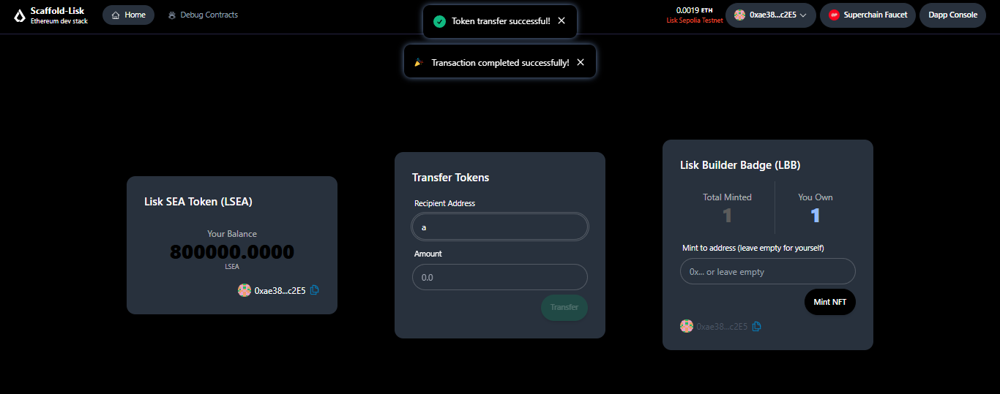

# 🚀 Speed Run Lisk — Connect Your Contracts to Frontend

This project is part of the **Lisk SEA Campaign Week 2 Challenge**, focused on connecting smart contracts on **Lisk Sepolia Testnet** to Frontend Next JS.

---

## 📖 Project Overview

This project demonstrates how to start the frontend local with smart contract — an **ERC20 Token (MyToken)** and an **ERC721 NFT (MyNFT)** — on the **Lisk Sepolia testnet**.

✅ **Verified Contracts**

- **MyToken (ERC20):** [0xBc69B1F0Daf36ed116A09f9Bf778CeD1a669eE62](https://sepolia-blockscout.lisk.com/address/0xBc69B1F0Daf36ed116A09f9Bf778CeD1a669eE62#code)
- **MyNFT (ERC721):** [0x61491AFaDabcf22E8e60d47352D8C4c974a36574](https://sepolia-blockscout.lisk.com/address/0x61491AFaDabcf22E8e60d47352D8C4c974a36574#code)

These contracts were deployed and verified using **Hardhat** and **Blockscout** integration.

✅ **Demo Url**
https://lisk-week2.netlify.app/

---

## 🧑‍💻 How to Run Locally

### 1️⃣ Clone the repository

```
git clone https://github.com/diananov11/Speed-Run-Lisk.git
git switch week-2
cd Speed-Run-Lisk
```

### 2️⃣ Install dependencies

```
yarn install
```

### 3️⃣ Start the frontend in local

```
yarn start
```

Try to transfer token and mint the NFT

